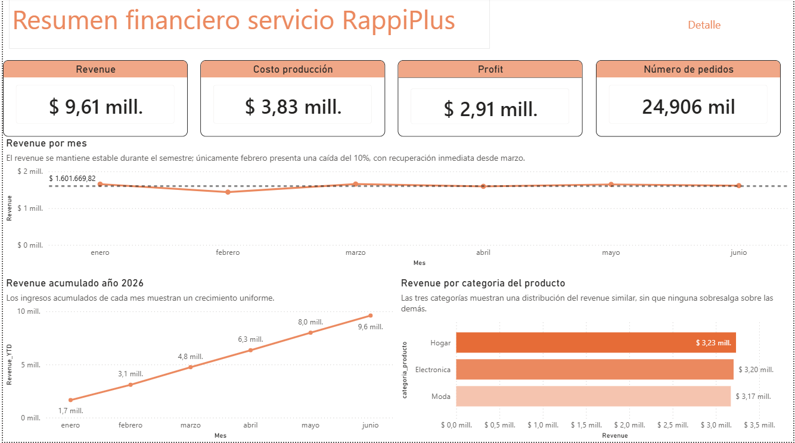
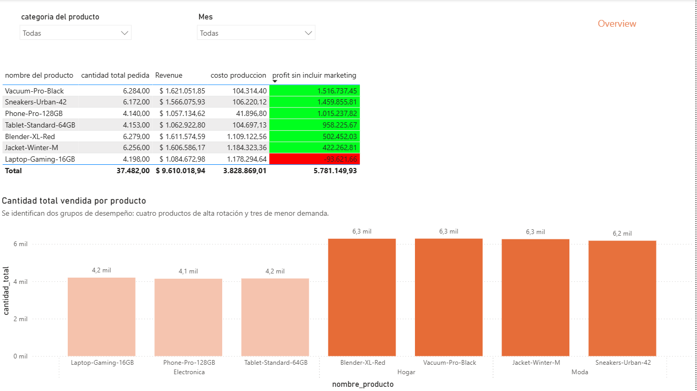
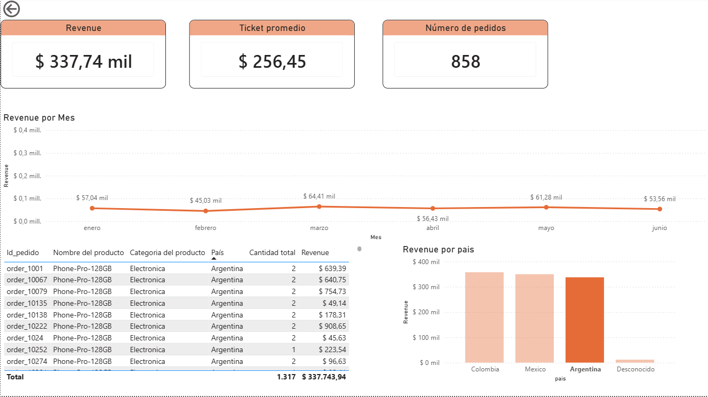

# 📊 RappiPlus | End-to-End Business Analysis

Proyecto de análisis de datos desarrollado como proyecto final del programa de **Análisis de Datos de TripleTen**, enfocado en evaluar el desempeño de RappiPlus y transformar diferentes fuentes de datos en información útil para la toma de decisiones.

El proyecto cubre un proceso analítico end-to-end: desde la limpieza y validación de datos hasta el análisis de rentabilidad, funnel de conversión, retención de usuarios, experimentación A/B y construcción de un dashboard en Power BI.

> **Nota:** Los datasets fueron proporcionados como parte del proyecto académico. No se afirma que correspondan a datos reales de una empresa.

---

## 🎯 Objetivo

Evaluar el desempeño del servicio RappiPlus desde diferentes perspectivas del negocio para responder preguntas como:

- ¿El negocio es rentable?
- ¿Cómo se comportan los ingresos y costos?
- ¿En qué etapa del funnel se pierden usuarios?
- ¿Los usuarios regresan después de registrarse?
- ¿Un cambio en la interfaz de checkout mejora la conversión?
- ¿Cómo comunicar los principales resultados mediante Business Intelligence?

---

## 📂 Fuentes de datos

El proyecto utiliza múltiples datasets relacionados con distintas áreas del negocio:

- **Orders:** pedidos, precios, descuentos e ingresos.
- **Catalog:** productos, categorías, costos y proveedores.
- **Marketing:** inversión en marketing por canal y país.
- **Events:** comportamiento de usuarios dentro de la plataforma.
- **Users:** información de usuarios registrados.
- **User Activity:** actividad posterior al registro.
- **Experiment Checkout UI:** resultados de un experimento A/B aplicado al proceso de checkout.

Los datos fueron proporcionados para el desarrollo del proyecto final de TripleTen.

---

## 🛠️ Herramientas utilizadas

- **Python**
- **Pandas**
- **SQL**
- **PostgreSQL**
- **Matplotlib**
- **Power BI**
- **Power Query**
- **DAX**
- **Estadística inferencial**
- **Jupyter Notebook**

---

## 🔎 Proceso de análisis

### 1. Calidad y preparación de datos

Se realizó una revisión de calidad de las principales fuentes de información antes de comenzar el análisis.

El proceso incluyó:

- Validación y conversión de fechas.
- Revisión de variables numéricas.
- Detección de valores negativos e inconsistentes.
- Identificación y tratamiento de valores atípicos.
- Eliminación de registros inconsistentes.
- Revisión de duplicados.
- Estandarización de variables categóricas.
- Tratamiento de valores faltantes.

Entre los problemas identificados se encontraron registros con cantidades o montos negativos y observaciones atípicas extremas que podían afectar los resultados del análisis.

---

### 2. 💰 Revenue y rentabilidad

Una vez preparados los datos, se calcularon los principales indicadores financieros del negocio.

| KPI | Resultado |
|---|---:|
| Revenue total | $9,62 M |
| Costo total de producción | $3,83 M |
| Inversión en marketing | $2,87 M |
| Profit | $2,92 M |
| Ticket promedio | $385,88 |
| Cantidad promedio por pedido | 1,50 |

El análisis muestra que, después de considerar costos de producción e inversión en marketing, el negocio mantiene un resultado positivo.

El margen de profit sobre revenue se sitúa aproximadamente en **30,4 %**.

---

### 3. 🛒 Funnel de conversión

Se utilizaron consultas SQL sobre los eventos de navegación para analizar el recorrido de los usuarios a través del funnel.

Etapas analizadas:

`First Visit → Select Item → Add to Cart → Begin Checkout → Add Payment Info → Purchase`

Usuarios únicos identificados en las principales etapas:

| Etapa | Usuarios |
|---|---:|
| First Visit | 7.796 |
| Select Item | 7.582 |
| Add to Cart | 7.634 |
| Begin Checkout | 7.208 |
| Add Payment Info | 6.250 |
| Purchase | 6.240 |

Uno de los principales puntos de pérdida se encuentra entre **Begin Checkout y Add Payment Info**, donde la conversión es aproximadamente **86,7 %**.

Una vez que el usuario agrega la información de pago, la conversión a compra es muy alta, cercana al **99,8 %**.

> La conversión superior al 100 % observada entre `Select Item` y `Add to Cart` indica que el comportamiento de los eventos no representa necesariamente un recorrido estrictamente lineal para todos los usuarios y debe interpretarse teniendo en cuenta la estructura del tracking.

---

### 4. 🔁 Retención por cohortes

Se construyó un análisis de cohortes utilizando el mes de registro de cada usuario y su actividad durante las semanas posteriores.

Se evaluó la retención durante:

- Semana 1
- Semana 2
- Semana 3

Los resultados muestran tasas de retención generalmente ubicadas alrededor del **40 % – 44 %** durante las primeras tres semanas.

El comportamiento relativamente estable entre cohortes sugiere que no existe una caída pronunciada de retención durante este período, aunque existe espacio para desarrollar estrategias orientadas a incrementar la recurrencia de los usuarios.

---

### 5. 🧪 Experimento A/B

Se evaluó si una modificación en la interfaz del checkout generaba un cambio estadísticamente significativo en la tasa de conversión.

Se plantearon las siguientes hipótesis:

**H₀:** La tasa de conversión del grupo control y del grupo tratamiento es igual.

**H₁:** Existe una diferencia entre las tasas de conversión.

Se aplicó una **prueba Z de proporciones** con:

`α = 0,05`

Resultados:

- **Z-statistic:** -0,813
- **p-value:** 0,416
- El grupo tratamiento presentó una conversión aproximadamente **0,6 puntos porcentuales superior**.

Sin embargo:

`p-value > 0,05`

Por lo tanto, **no se rechazó la hipótesis nula**.

Aunque el grupo tratamiento mostró una conversión ligeramente superior, no existe evidencia estadística suficiente para concluir que el cambio en la interfaz haya causado una mejora real en la conversión.

---

## 💡 Principales hallazgos

- RappiPlus generó aproximadamente **$9,62 M de revenue** durante el período analizado.

- Después de considerar aproximadamente **$3,83 M en costos de producción** y **$2,87 M en marketing**, se obtuvo un **profit cercano a $2,92 M**.

- El margen de profit representa aproximadamente **30 % del revenue**.

- En el funnel, una de las principales oportunidades de mejora aparece durante la transición entre **checkout e ingreso de información de pago**.

- Una vez ingresada la información de pago, prácticamente todos los usuarios completan la compra.

- La retención durante las primeras tres semanas se mantiene relativamente estable alrededor del **40 % – 44 %**.

- El experimento A/B mostró una mejora de aproximadamente **0,6 puntos porcentuales** en el grupo tratamiento, pero la diferencia **no fue estadísticamente significativa** (`p = 0,416`).

---

## 🎯 Recomendaciones de negocio

A partir de los resultados del análisis:

1. **Analizar el proceso entre checkout y pago**, ya que representa uno de los puntos con mayor pérdida de usuarios dentro del funnel.

2. **Investigar oportunidades para mejorar la retención**, dado que aproximadamente cuatro de cada diez usuarios permanecen activos durante las primeras semanas.

3. **No implementar el cambio de interfaz únicamente con base en el experimento actual**, ya que la mejora observada no presenta evidencia estadística suficiente.

4. **Continuar monitoreando revenue, costos, marketing y profit** mediante indicadores de Business Intelligence para identificar cambios en la rentabilidad.

5. Utilizar nuevos experimentos A/B para validar futuras modificaciones del producto antes de implementarlas de manera general.

---

## 📊 Dashboard de Power BI

Como etapa final del proyecto se desarrolló un dashboard interactivo de **3 páginas en Power BI**, diseñado para analizar el desempeño financiero del servicio desde diferentes niveles de detalle.

### 1. Overview — Resumen financiero

La página principal presenta una visión ejecutiva del desempeño general del negocio mediante KPIs y tendencias.

Incluye:

- Revenue total.
- Costos de producción.
- Profit considerando la inversión en marketing.
- Número de pedidos.
- Evolución mensual del revenue.
- Revenue acumulado.
- Distribución del revenue por categoría de producto.

---

### 2. Detalle — Análisis por producto

La segunda página permite profundizar en el desempeño comercial y financiero de los productos mediante filtros interactivos.

Incluye:

- Filtros por categoría de producto y mes.
- Revenue por producto.
- Costos de producción.
- Profit por producto antes de marketing.
- Cantidad total vendida.
- Comparación del desempeño entre productos y categorías.

---

### 3. Drill-through — Análisis específico

La tercera página utiliza la funcionalidad **Drill-through de Power BI** para profundizar en un producto seleccionado desde el dashboard.

Permite analizar:

- Revenue del producto seleccionado.
- Ticket promedio.
- Número de pedidos.
- Evolución mensual del revenue.
- Detalle de pedidos.
- Distribución del revenue por país.

Esta funcionalidad permite pasar de una visión general del negocio a un análisis específico sin perder el contexto del producto seleccionado.

El archivo `.pbix` completo se encuentra disponible en la carpeta [`dashboard`](dashboard/).

---

---

## 📓 Notebook

El análisis completo, incluyendo limpieza de datos, consultas SQL, análisis de cohortes y prueba estadística, puede consultarse en:

[`notebooks/rappiplus_business_analysis.ipynb`](notebooks/rappiplus_business_analysis.ipynb)

Las credenciales utilizadas originalmente para acceder a la base de datos no se incluyen por motivos de seguridad y privacidad. Las consultas SQL y sus resultados se conservan como evidencia del proceso de análisis realizado.

---

## 👤 Autor

**Santiago Rodríguez Pérez**

Proyecto desarrollado como parte del programa de **Análisis de Datos de TripleTen** y adaptado posteriormente para su presentación como proyecto de portafolio.
